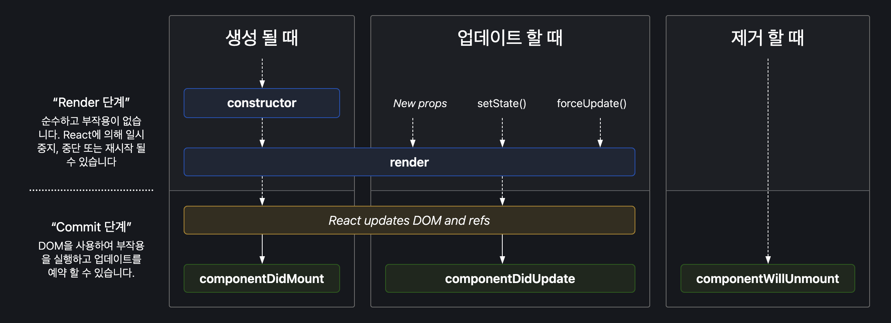

## 2.3 클래스형 컴포넌트와 함수형 컴포넌트

### 2.3.1 클래스형 컴포넌트

```javascript
import React from 'react'

interface SampleProps {
  required?: boolean;
  text: string;
}

interface SampleState {
  count: number;
  isLimited?: boolean
}

class SampleComponent extends React.Component<SampleProps, SampleState> {
  private constructor(props: SampleProps) {
    super(props);
    this.state = {
      count: 0,
      isLimited: false
    }
  }

  private handleClick = () => {
    const newValue = this.state.count + 1;
    this.setState({ count: newValue, isLimited: newValue >= 10 })
  }

  public render() {
    const {
      props: { required, text },
      state: { count, isLimited }
    } = this;

    return (
      <h2>
        Sample Component
        <div>{required ? '필수' : '필수 아님'}</div>
        <div>문자: {text}</div>
        <div>count: {count}</div>
        <button onClick={this.handleClick} disabled={disabled}>
          증가
        </button>
      </h2>
    )
  }
}

```

클래스형 컴포넌트를 만들기 위해서는 클래스를 선언하고 extends로 만들고 싶은 컴포넌트를 extends해야 함
extends 구문에 넣을 수 있는 클래스는 다음과 같음

- React.Component
- React.PureComponent

constructor()

- 컴포넌트 내부 생성자 함수임
- 해당 함수는 컴포넌트가 초기화되는 시점에 호출됨
- super()는 컴포넌트를 만들면서 상속받은 상위 컴포넌트, 즉 React.Component의 생성자 함수를 먼저 호출해 필요한 상위 컴포넌트에 접근할 수 있게 도와줌

메서드

- 렌더링 함수 내부에서 사용되는 함수임
- 메서드 함수를 만드는 방식은 아래 3가지 정도임

  - constructor에서 this 바인드를 하는 방법: 일반 함수로 메서드를 만들면 this는 undefined로 나옴, 이는 생성자가 아닌 일반 함수로 호출하게 되면 this에 전역 객체가 바인딩되기 때문임
    이때, strict 모드에서는 undefinedrk skdhrp ehla
    따라서 생성된 함수에 bind를 활용해서 강제로 this를 바인딩해야 함

  ```javascript
  import {Component} from 'react';

  type Props = Record<string, never>

  interface State {
    count: number;
  }

  class SampleComponent extends Component<Props, State> {
    private constructor(props: Props) {
      super(props)
      this.state = {
        count: 1
      }
      this.handleClick = this.handleClick.bind(this)
    }

    private handleClick() {
      this.setState((prev) => ({count: prev.count + 1}))
    }

    public render() {
      const {
        state: {count}
      } = this

      return (
        <div>
          <button onClick={this.handleClick}>증가</button>
          {count}
        </div>
      )
    }
  }
  ```

  - 화살표 함수를 쓰는 방법: 화살표 함수는 this가 상위 스코프로 결정되기 때문에 굳이 바인딩하지 않아도 사용할 수 있음
  - 렌더링 함수 내부에서 함수를 새롭게 만들어 전달하는 방법: 하지만 아래 방법을 사용하면 매번 렌더링시마다 새로운 함수를 생성해 할당하게 되므로 최적화를 수행하기 어려워짐

  ```javascript
  <button onClick={() => this.handleClick()}>증가</button>
  ```

클래스형 컴포넌트의 생명주기 메서드
생명주기 메서드가 실행되는 시점은 크게 세 가지로 나눌 수 있음

- 마운트: 컴포넌트가 마운팅(생성)되는 시점
- 업데이트: 이미 생성된 컴포넌트의 내용이 변경(업데이트)되는 시점
- 언마운트: 컴포넌트가 더 이상 존재하지 않는 시점

render()
생명주기 메서드 중 하나임
UI를 렌더링하기 위해서 쓰이는데, 마운트와 업데이트 과정에서 일어남
이 함수는 항상 순수해야 하고 부수 효과가 없어야 함
render() 내부에서 state를 직접 업데이트하는 this.setState를 호출하면 안 됨
state 변경은 클래스형 컴포넌트의 메서드나 다른 생명주기 메서드 내부에서 발생해야 함

componentDidMount()
클래스형 컴포넌트가 마운트되고 준비된 후 호출되는 생명주기 메서드임
이 함수 내부에서는 this.setState()로 state 값을 변경하는 것이 가은항
state가 변경되면 즉시 렌더링을 시도하는데, 브라우저가 실제로 UI를 업데이트하기 전에 실행되어 사용자가 변경 사실을 눈치챌 수 없음
다만 성능 문제를 일으킬 수 있으니 state를 다루는 것은 생성자에서 하는 것이 좋음
componentDidMount에서 this.setState를 허용하는 것은 생성자 함수에서는 할 수 없는 것, API 호출 후 업데이트, DOM에 의존적인 작업 등을 하기 위해서임

componentDidUpdate()
컴포넌트 업데이트가 일어난 이후 바로 실행됨
일반적으로 state나 props 변화에 따라 DOM을 업데이트하는 등에 쓰임
this.setState 호출 가능

```javascript
componentDidUpdate(prevProps: Props, prevState: State) {
  if (this.props.userName !== prevProps.userName) {
    this.fetchData(this.props.userName)
  }
}
```

componentWillUnmount()
컴포넌트가 언마운트되거나 더 이상 사용되지 않기 직전에 호출됨
메모리 누수나 불필요한 작동을 막기 위한 클린업 함수를 호출하기 위함
this.setState 호출 불가능

```javascript
componentWillUnmount() {
  window.removeEventListener('resize', this.resizeListener)
  clearInterval(this.intervalId)
}
```

shouldComponentUpdate()
state나 props의 변경으로 리액트 컴포넌트가 다시 리렌더링되는 것을 막고 싶을 때 사용
this.setState가 호출되면 기본적으로 리렌더링을 일으킴
이 메서드 활용 시 컴포넌트에 영향을 받지 않는 변화에 대해 정의 가능
이 메서드는 특정한 성능 최적화 상황에서만 고려해야 함
아래 예시에서는 false인 경우에 리렌더링을 하지 않는다고 보면 됨

```javascript
shouldComponentUpdate(nextProps: Props, nextState: State) {
  return this.props.title !== nextProps.title || this.state.input !== nextState.input
}
```

```javascript
import React from 'react';

interface State {
  count: number;
}

type Props = Record<string, never>;

export class ReactComponent extends React.Component<Props, State> {
  private renderCounter = 0;

  private constructor(props: Props) {
    super(props);
    this.state = {
      count: 1
    };
  }

  private handleClick = () => {
    this.setState({ count: 1 });
  };

  public render() {
    console.log('ReactComponent', ++this.renderCounter);
    return (
      <h1>
        ReactComponent: {this.state.count}{' '}
        <button onClick={this.handleClick}>+</button>
      </h1>
    );
  }
}
```

위 코드에서 React.Component를 React.PureComponent로 변경하면 콘솔에 찍히는 결과가 달라짐
Component는 버튼을 누를 떄마다 state가 업데이트됨
따라서 리렌더링이 일어남
하지만, PureComponent는 state 값에 대해서 얕은 비교를 수행해 결과가 다를 때만 렌더링을 수행하기 때문에 위의 경우 렌더링이 별도로 일어나지 않음
PureComponent는 얕은 비교만 수행하기 때문에 복잡한 구조의 데이터 변경은 감지하지 못해 예상 밖의 결과를 불러올 수 있음

static getDerivedStateFromProps()
render()를 호출하기 직전에 호출됨
정적 메서드라 this에 접근할 수 없음
이 메서드가 반환하는 객체는 해당 객체의 내용이 모두 state로 들어가게 됨
null 반환 시 아무 일도 일어나지 않음
다음에 올 props를 바탕으로 현재의 state를 변경하고 싶을 때 사용할 수 있음

```javascript
static getDerivedStateFromProps(nextProps: Props, prevState: State) {
  if (props.name !== state.name) {
    return {
      name: props.name
    }
  }

  return null;
}
```

getSnapShotBeforeUpdate()
DOM이 업데이트되기 직전에 호출됨
이 메서드가 반환하는 값은 componentDidUpdate로 전달됨
DOM에 렌더링되기 전에 윈도우 크기를 조절하거나 스크롤 위치를 조정하는 등 작업을 처리하는데 유용함
세 번째 인수인 snapshot은 클래스 제네릭의 세 번째 인수로 넣어줄 수 있음

```javascript
getSnapshotBeforeUpdate(prevProps: Props, prevState: State) {
  if (prevProps.list.length < this.props.list.length) {
    const list = this.listRef.current
    return list.scrollHeight - list.scrollTop
  }
  return null
}

componentDidUpdate(prevProps: Props, prevState: State, snapshot: Snapshot) {
  if (snapshot !== null) {
    const list = this.listRef.current
    list.scrollTop = list.scrollHeight - snapshot
  }
}
```



getDerivedStateFromError()
에러 상황에서 실행되는 메서드임
getSnapshotBeforeUpdate, getDerivedStateFromError, componentDidCatch는 리액트 훅으로 구현되어 있지 않아 세 메서드가 필요한 경우 반드시 클래스형 컴포넌트를 사용해야 함
이 메서드는 자식 컴포넌트에서 에러가 발생했을 때 호출되는 에러 메서드임

getDerivedStateFromError는 정적 메서드임
이 메서드는 반드시 state 값을 반환해야 하는데, 이는 getDerivedStateFromError는 하위 컴포넌트에서 에러가 발생했을 경우 어떻게 자식 리액트 컴포넌트를 렌더링할지 결정하는 용도로 제공되는 메서드이기 때문에 미리 정의해 둔 state 값을 반환해야 함
이 메서드에서는 부수 효과를 발생시켜서는 안 되고, 별도의 부수 효과를 처리하기 위해서는 componentDidCatch를 사용하면 됨

componentDidCatch
이 메서드는 자식 컴포넌트에서 에러가 발생했을 때 실행되고, getDerivedStateFromError에서 에러를 잡고 state를 결정한 후 실행됨
componentDidCatch는 두 개의 인수를 받는데, 첫 번째는 getDerivedStateFromError와 동일한 error, 또 정확히 어떤 컴포넌트가 에러를 발생시켰는지 정보를 가지고 있는 info임

```javascript
import React, { ErrorInfo, PropsWithChildren } from 'react';

type Props = PropsWithChildren<{}>
type State = { hasError: boolean; errorMessage: string }

export default class ErrorBoundary extends React.Component<Props, State> {
  constructor(props: Props) {
    super(props)
    this.state = {
      hasError: false,
      errorMessage: ''
    }
  }

  static getDerivedStateFromError(error: Error) {
    return {
      hasError: true,
      errorMessage: error.toString()
    }
  }

  componentDidCatch(error: Error, info: ErrorInfo) {
    console.log(error)
    console.log(info)
  }

  render() {
    if (this.state.hasError) {
      return (
        <div>
          <h1>에러가 발생했습니다.</h1>
          <p>{this.state.errorMessage}</p>
        </div>
      )
    }

    return this.props.children
  }
}
```

componentDidCatch에서는 getDerivedStateFromError에서 하지 못했던 부수 효과를 수행할 수 있는데 이는 render 단계에서 실행되는 getDerivedStateFromError와는 다르게 componentDidCatch는 커밋 단계에서 실행되기 떄문
따라서 componentDidCatch는 에러 정보를 바탕으로 로깅하는 등 용도로 사용 가능

이렇게 구현된 에러 바운더리는 애플리케이션 루트에서 사용되지만 에러 바운더리 경계 외부에 있는 에러는 잡을 수 없음
즉, 에러 바운더리를 여러 개 선언해서 컴포넌트별로 에러 처리를 다르게 적용할 수 있기도 함

클래스형 컴포넌트의 한계

- 데이터 흐름을 추적하기 어려움
  여러 메서드에서 state의 업데이트가 일어날 수 있음
- 로직 재사용이 어려움
  컴포넌트 간 중복 로직을 재사용하고 싶은 경우, 컴포넌트를 또 다른 고차 컴포넌트로 감싸거나 props를 넘겨줄 수 있음
  하지만 이는 공통 로직이 많아질수록 감싸는 고차 컴포넌트나 props가 많아지는 래퍼 지옥에 빠질 수 있음
  컴포넌트를 상속해서 관리할 수도 있지만, 여러 클래스를 확인해야 하기 떄문에 코드 흐름을 파악하기 힘들 수 있음
- 기능이 많아질수록 컴포넌트 크기가 커짐
- 코드 크기를 최적화하기 어려움
  클래스형 컴포넌트는 최종 결과물인 번들 크기를 줄이는 데도 어려움을 겪을 수 있음
  사용되지 않는 메서드가 빌드 후 트리쉐이킹이 되지 않고 번들에 그대로 포함됨
- 핫 리로딩을 하는데 상대적으로 불리함
  핫 리로딩은 코드에 변경 사항이 발생했을 때 앱을 다시 시작하지 않아도 변경된 코드만 업데이트해서 변경 사항을 빠르게 적용하는 기법을 말함
  함수형 컴포넌트의 경우, 핫 리로딩이 일어난 뒤에도 변경된 상태값이 유지되지만, 클래스형 컴포넌트는 핫 리로딩이 일어난 후 state가 초기값으로 돌아가는 것을 볼 수 있음
  클래스형 컴포넌트는 최초 렌더링 시 인스턴스를 생성하고 내부에서 state 값을 관리하는데, 해당 인스턴스 내부에 있는 render를 수정하게 되면 이를 반영하기 위해서는 새로운 인스턴스를 만드는 방법뿐임
  반면 함수형 컴포넌트는 state를 함수가 아닌 클로저에 저장해 두기 떄문에 함수가 다시 실행돼도 해당 state 값을 잃어버리지 않게 됨

따라서, 기존의 무상태 함수형 컴포넌트에 상태를 더할 수 있는 훅을 출시해 함수형 컴포넌트를 사용하도록 함
