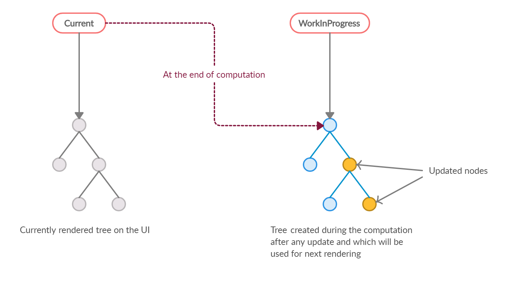

# 2.2 가상 DOM과 리액트 파이버

## DOM과 브라우저 렌더링 과정

**DOM**이란 **웹페이지에 대한 인터페이스**로 브라우저가 **웹페이지의 콘텐츠와 구조**를 어떻게 보여줄지에 대한 **정보**를 담고 있다.

### 브라우저 렌더링 과정

1. 요청한 주소로부터 **HTML 파일을 다운**로드 받는다.
2. HTML 파일을 파싱하여 **DOM을 구성**한다.
3. HTML에서 **CSS 파일을 만나면 다운**로드 받는다.
4. CSS 파일을 파싱하여 **CSSOM을 구성**한다.
5. 다운로드 받은 HTML에서 `display: none;`과 같이 **눈에 보이지 않는 것들을 제외한 노드들을 방문**한다. 이는 트리 분석을 조금이라도 더 빠르게하기 위함이다.
6. CSSOM을 기반으로 **DOM에 CSS를 적용**한다. CSS를 적용하는 과정은 두 가지가 있다.
   - 레이아웃(layout, reflow): 노드가 브라우저 화면의 어느 좌표에 나타나야 하는지 계산하는 과정이다. 이 과정을 거치면 페인팅도 반드시 거치게 된다.
   - 페인팅(painting): 레이아웃을 거친 노드들에 실제 유효한 모습을 그리는 과정이다.

[출처: Render-tree Construction, Layout, and Paint](https://web.dev/articles/critical-rendering-path/render-tree-construction?hl=ko)

아래 예제 코드를 이용하여 위의 과정을 설명해 보겠다.

```html
<!-- style.css -->
#text { background-color: red; color: white; }

<!-- index.html -->
<!DOCKTYPE html>
<html>
  <head>
    <link rel="stylesheet" type="text/css" href="./style.css" />
    <title>Hello React!</title>
  </head>
  <body>
    <div style="width: 100%;">
      <div id="text" style="width: 50%;">Hello World!</div>
    </div>
  </body>
</html>
```

1. HTML을 다운로드 받으며 분석한다.
2. link에 있는 `style.css`를 다운로드 한다.
3. 첫 번째 div 태그의 width는 뷰포트가 되고, 두 번째 div 태그의 width는 뷰포트의 절반으로 계산한다.
4. `styles.css`에서 `id="text"`인 style을 찾아 적용시킨다.
5. HTML을 그리기 위한 준비가 완료됐으므로 위 정보를 바탕으로 렌더링을 수행한다.

## 가상 DOM의 탄생 배경

### 탄생 배경

브라우저가 리렌더링 되는 경우는 아래와 같다.

- 색상의 변경 -> 페인팅만 다시하면 되기 때문에 비교적 빠름
- 노출 여부 혹은 사이즈의 변경 -> 레이아웃이 일어나고 페인팅이 발생하여 많은 비용 듦. 또한 자식 요소가 많다면 해당 자식 요소들에 대해서도 변경이 일어나기 때문에 더 많은 비용이 발생.

이러한 사용자와의 상호작용에서 DOM을 추적하는 일은 개발자에게 수고스러운 일이다.

위의 문제점을 해결하기 위해 가상 DOM이 나왔다.

### 가상 DOM

**가상 DOM**은 말 그대로 브라우저의 DOM이 아닌 **리액트에서 관리하는 가상의 DOM**이다. 가상 DOM은 웹페이지가 표시해야 할 DOM을 메모리에 저장하고 리액트가 변경에 대해 준비가 되었을 때 실제 브라우저의 DOM에 반영한다.

가상 DOM에 대한 가장 일반적인 오해는 가상 DOM의 방식이 일반적인 DOM을 관리하는 브라우저보다 빠르다는 사실이다. 무조건 빠르다는 것이 아닌 대부분의 상황에서 웬만한 애플리케이션을 만들 수 있을 정도로 충분히 빠르다는 것이다.

## 가상 DOM을 위한 아키텍처, 리액트 파이버

### 리액트 파이버란?

파이버는 파이버 재조정자가 관리하는데, 이는 **가상 DOM과 실제 DOM을 비교**하여 변경이 필요한 파이버에 대해 **재조정**을 하는 역할을 한다.

> **재조정이란?**
>
> 가상 DOM과 실제 DOM을 비교하는 알고리즘이다.

**리액트 파이버**의 목표는 리액트 웹 애플리케이션에서 발생하는 **애니메이션**, **레이아웃**, 그리고 **사용자 인터랙션**에 올바른 결과물을 만드는 **반응성 문제를 해결**하는 것이다.

파이버는 다음과 같은 일을 할 수 있다.

- 작업을 작은 단위로 분할하고 쪼갠 다음, 우선순위를 매긴다.
- 이러한 작업을 일시 중지하고 나중에 다시 시작할 수 있다.
- 이전에 했던 작업을 다시 재사용하거나 필요하지 않은 경우에는 폐기할 수 있다.

위의 과정들은 모두 **비동기**로 이루어진다.

파이버는 컴포넌트가 최초로 마운트되는 시점에 생성되어 이후에는 **가급적이면 재사용**된다.

리액트 파이버의 구현체에 선언된 속성들에 대한 내용은 아래와 같다.

- tag: 파이버는 하나의 element와 1:1로 관계를 가지고 있다. 이때 **매칭된 정보를 가지고 있는 것**이 tag이다. 1:1로 연결되는 것은 리액트의 컴포넌트 혹은 HTML의 DOM 등 다양한 값들이 가능하다.
- stateNode: **파이버 자체에 대한 참조 정보**를 가지고 있으며, 이 참조를 바탕으로 리액트는 파이버와 관련된 상태에 접근한다.
- child, sibiling, return: **파이버 간의 관계 개념**을 나타내는 속성이다.
- index: **여러 형제들(sibiling) 사이에서 자신의 위치**가 몇 번째인지 숫자로 표현한다.
- pendingProps: pendingProps를 기준으로 **렌더링이 완료된 이후에 pendingProps를 memoizedProps로 저장**해 관리한다.
- updateQueue: 상태 업데이트, 콜백 함수, DOM 업데이트 등 **필요한 작업을 담아두는 큐**이다.
- memoizedState: **함수 컴포넌트의 훅 목록이 저장**된다. 단순히 `useState`뿐만 아니라 모든 훅 리스트가 저장된다.
- alternate: 리액트의 트리는 두 개인데, **반대편 트리 파이버**를 가리킨다.

### 리액트 파이버 트리

앞서 언급했듯 리액트 내부에는 **파이버 트리가 두 개**가 존재한다. 하나는 **현재 모습을 담은 파이버 트리**이고, 다른 하나는 **작업 중인 상태를 나타내는 workInProgress 트리**다. 리액트의 작업이 끝나면 **포인터만 workInProgress 트리를 현재 트리로 바꿔**버린다. 이러한 기술을 **더블 버퍼링**이라고 한다.

[출처: An Introduction to React Fiber - The Algorithm Behind React](https://www.velotio.com/engineering-blog/react-fiber-algorithm)

이를 통해 미처 다 그리지 못한 모습을 노출시키지 않을 수 있다.
