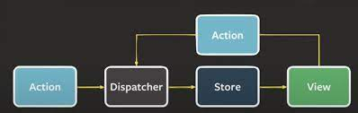

# 5.1 상태 관리는 왜 필요한가?

**상태**란 **어떠한 의미를 지닌 값**이며 애플리케이션의 시나리오에 따라 **지속적으로 변경될 수 있는 값**을 의미한다.

## 리액트 상태 관리의 역사

### Flux 패턴의 등장

**Flux 패턴**이란 **데이터가 단방향으로 흐르는 것**을 의미한다.

- 액션(action): 어떠한 작업을 처리할 액션과 발생 시 함께 포함시킬 데이터를 의미한다. 액션 타입과 데이터를 각각 정의해 디스패처로 보낸다.
- 디스패처(dispatcher): 액션을 스토어에 보내는 역할을 한다.
- 스토어(store): 실제 상태에 따른 값과 상태를 변경할 수 있는 메서드를 가지고 있다. 액션의 타입에 따라 어떻게 변경될지가 정의돼 있다.
- 뷰(view): 리액트의 컴포넌트에 해당하는 부분으로, 스토어에서 만들어진 데이터를 가져와 화면을 렌더링하는 역할을 한다. 또한 뷰에서도 사용자의 입력이나 행위에 따라 상태를 업데이트하고자 할 수 있을 것이다.

### 시장 지배자 리덕스의 등장

리덕스의 등장으로 prop drilling을 해결할 수 있었고, 스토어가 필요한 컴포넌트라면 connect만 쓰면 스토어에 바로 접근할 수 있었다. 하지만 하고자 하는 일에 비해 보일러플레이트가 너무 많다는 비판의 목소리가 있었다.

### Context API와 useContext

prop drilling을 피하기 위해 리덕스를 사용하자니 단순히 상태를 참조하고 싶을 뿐인데 준비해야 하는 보일러플레이트가 부담스러웠다.

리액트 팀은 이를 위해 [useContext](https://github.com/MDR-eact/modern-react-deep-dive/blob/main/MDR-eact/gs0428/Week4/3.1.md#usecontext)라는 새로운 Context API를 제공하였다.
